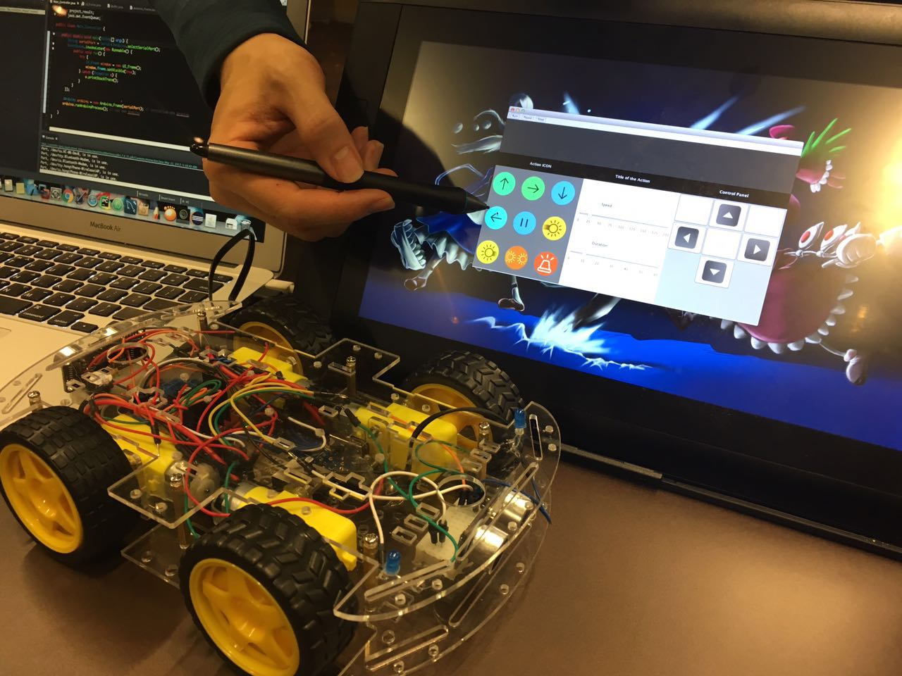
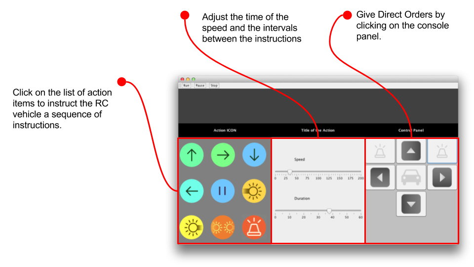
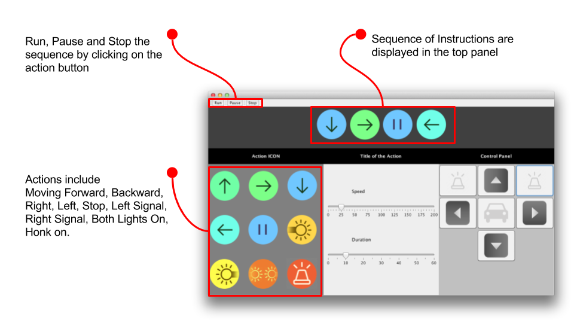
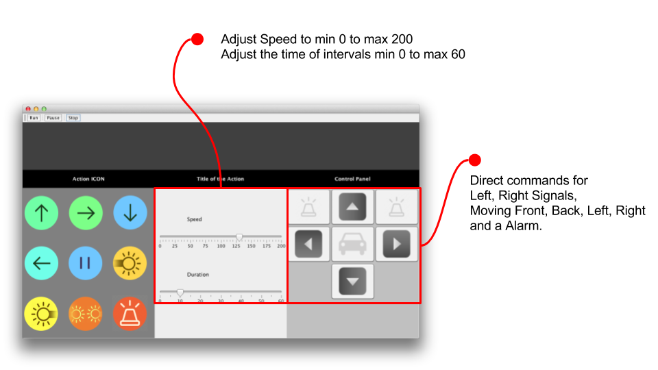

# SW_Hackthon_2017

### - project architecture
1. Buffer [link](src/main/java/project_result/Buffer.java)
   - shares stack data for sending messages between the java and arduino 
   - java application adds messages in the stack
   - arduino reads the messages from the stack 

2. Arduino_Frame [link](src/main/java/project_result/Arduino_Frame.java)
   - inspired by java friendly based implementation of arduino codes 
   - arduino instructions are saved within this file 

3. UI_Frame [link](src/main/java/project_result/UI_Frame.java)
   - use java awt library for user friendly interface. 
   - actionlisteners are implemented in this file  

4. Main_Controller [link](src/main/java/project_result/Main_Controller.java)
   - the file that runs the program 

 
 

### - UI Instructions 

